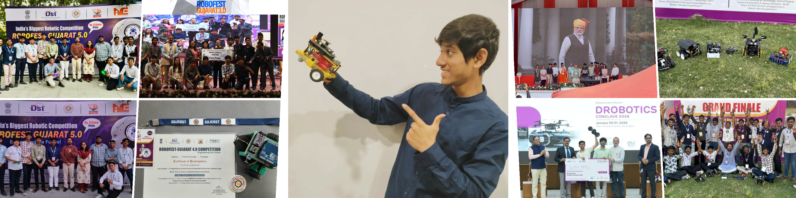
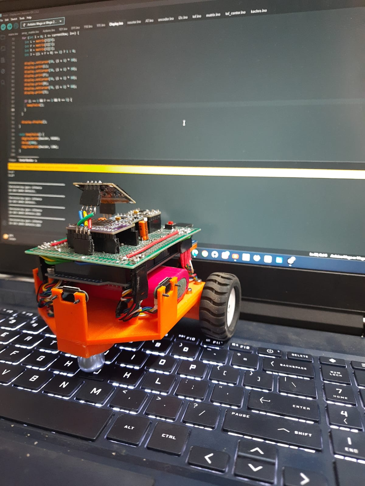
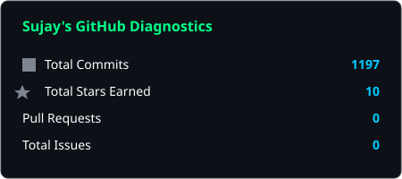
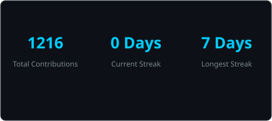

<div align="center">

<!-- Robotics Projects Banner Collage -->


</div>

<!-- Typing animation -->
<div align="center">


</div>

---

<!-- About Section -->
<table align="center" width="95%">
<tr>
<td width="55%" valign="top">

## 🤖 `> BOOT SEQUENCE INITIATED`

```yaml
Engineer  : Patel Sujay Hemil
Origin    : India 🇮🇳
Education : Instrumentation & Control (B.Tech)
Domain    : Robotics Systems & Embedded Hardware
Focus     : Embodied AI & Fleet Telemetry
Status    : ONLINE 🟢
```

### 🔭 Current Missions
- 📡 **Fleet Telemetry** — Real-time IoT monitoring & motion tracking systems
- 🧠 **Embodied AI** — Autonomous navigation and control for physical robots
- 👁️ **Computer Vision** — Advanced OpenCV algorithms & real-time detection
- 🚀 **Hardware Startups** — Prototyping and developing commercial electronics

</td>
<td width="45%" align="center" valign="top">

<br>



<br><br>

> *"Building the hardware that moves,*  
> *and the code that thinks."*  
> — **Sujay Patel**

</td>
</tr>
</table>

---

## 🏆 `> MILESTONES UNLOCKED`

* **Rath Yatra 2026 Fleet Telemetry (Chief Technology Lead)**
  * Deployed **28 custom IoT/GPS/Motion-tracking hardware devices** to monitor a 101-truck fleet in real-time, monitored by the Chief Minister of Gujarat.
* **Swadeshi Parakh Platform (Chief Technology Lead)**
  * Spearheaded a 5-day sprint to launch the verification platform live. Received an **official letter of appreciation** from Shri Bhupendra Patel (Hon'ble CM of Gujarat).
* **Autonomous AMRs (Robofest Gujarat 5.0)**
  * Engineered a commercial-grade AMR using ToF sensors, I2C multiplexers, and gyroscopes. **First Prize Winner (₹10 Lakh Category)**.
* **Self-Balancing Robot (Robofest Gujarat 3.0)**
  * Built an inverted pendulum robot with stepper motors and custom PID algorithm. **Consolation Prize Winner (₹2.5 Lakhs)**.
* **National Robo Race Championship (Adani University)**
  * **First Prize Winner (₹25,000)** at the Adani Drobotics Conclave.
* **Dentino Product Architect**
  * Co-developed a wireless streaming transmitter for intraoral cameras. Generated ₹1,00,000+ profit.

---

## 🛠️ `> LOADING TECH STACK...`

<div align="center">

### Languages


### Robotics & Vision


### Hardware & Design


### Tools & Platforms


</div>

---

## 📊 `> SYSTEM DIAGNOSTICS`

<div align="center">


&nbsp;


<br>



</div>

---

## 🏅 `> TROPHY ROOM`

<div align="center">


</div>

---

## 🚀 `> ACTIVE PROJECTS`

<div align="center">

| Project | Description | Status |
|:---|:---|:---:|
| 🐝 **Swarm Robots** | Multi-agent autonomous coordination system | 🟢 Active |
| 🚁 **Dream Military Drones** | Autonomous aerial surveillance & defense | 🟡 In Progress |
| 🏆 **RoboFest 4.0** | Competitive robotics challenge | 🔵 Competing |
| 👁️ **OpenCV Algorithms** | Computer vision & real-time detection | 🟢 Learning |

</div>

---

## 📡 `> ESTABLISH CONNECTION`

<div align="center">

[](mailto:sujaypatel07@gmail.com)

[](https://linkedin.com/in/sujay-patel-38a460283)

[](https://instagram.com/sujayr07)

[](https://youtube.com/@roboticengineerwala)

</div>

---

## 📈 `> VISITOR LOG`

<div align="center">


&nbsp;

&nbsp;


</div>

---

<!-- Footer Wave -->
<div align="center">


</div>
