<div align="center">

<!-- hero: monochrome ASCII portrait (types in) beside the extruded 3d ascii
     wordmark (wipes in left-to-right, then rocks on its vertical axis). -->

<h3><code>sujay@github ~ $ whoami</code></h3>

<table>
<tr>
<td valign="top"></td>
<td valign="top"></td>
</tr>
</table>

<br>
<br>

<h3><code>sujay@github ~ $ ./links.sh</code></h3>

<p><b>Robotics Systems Architect · Hardware Product Developer · Tech Entrepreneur</b></p>

[](https://linkedin.com/in/sujay-patel-38a460283)
[](https://instagram.com/sujayr07)
[](https://youtube.com/@roboticengineerwala)
[](https://t.me/SujayPatel)

<br>
<br>

</div>

---

### 🤖 `> BOOT SEQUENCE INITIATED`

```yaml
Engineer  : Patel Sujay Hemil
Origin    : India 🇮🇳
Domain    : Robotics, Hardware Engineering & Physical AI
Status    : ONLINE ✅
Mission   : Building the Future of Embodied AI, One Bot at a Time
Grants    : Raised ₹6L+ in Product & Hardware Grants
```

---

<h3><code>sujay@github ~ $ ./milestones.sh</code></h3>

* **Rath Yatra 2026 Fleet Telemetry (Chief Technology Lead)**
  * Deployed **28 custom IoT/GPS/Motion-tracking hardware devices** to monitor a 101-truck fleet in real-time, monitored by the Chief Minister of Gujarat.
* **Swadeshi Parakh Platform (Chief Technology Lead)**
  * Spearheaded a 5-day sprint to launch the verification platform live. Received an **official letter of appreciation** from Shri Bhupendra Patel (Hon'ble CM of Gujarat).
* **Autonomous AMRs (Robofest Gujarat 5.0)**
  * Engineered a commercial-grade AMR using ToF sensors, I2C multiplexers, and gyroscopes. **First Prize Winner (₹10 Lakh Category)**.
* **Self-Balancing Robot (Robofest Gujarat 3.0)**
  * Built an inverted pendulum robot with stepper motors and custom PID algorithm. **Consolation Prize Winner (₹2.5 Lakhs)**.
* **National Robo Race Championship (Adani University)**
  * **First Prize Winner (₹25,000)** at the Adani Drobotics Conclave.
* **Dentino Product Architect**
  * Co-developed a wireless streaming transmitter for intraoral cameras. Generated ₹1,00,000+ profit.

---

<h3><code>sujay@github ~ $ ./tech_stack.sh</code></h3>

#### 🛠️ Core Capabilities

* **Robotics & Physical AI**: Robot Operating System (ROS), Autonomous Navigation, PID Control, Kinematics, Motion Planning.
* **Embedded & Hardware**: C/C++, Embedded C, Raspberry Pi 5, RPi Pico 2 W, Arduino Mega, PLC (Ladder Logic), ToF Sensors, MPU6050, PCB Design, 3D Printing (Ender 3 Pro), CAD (Fusion 360).
* **Software & Web**: Python, OpenCV, Web/App Development, Satellite Image Analysis.

<div align="center">


</div>

---

<h3><code>sujay@github ~ $ ./diagnostics.sh</code></h3>

<div align="center">


&nbsp;


</div>

<br>

<div align="center">


</div>
